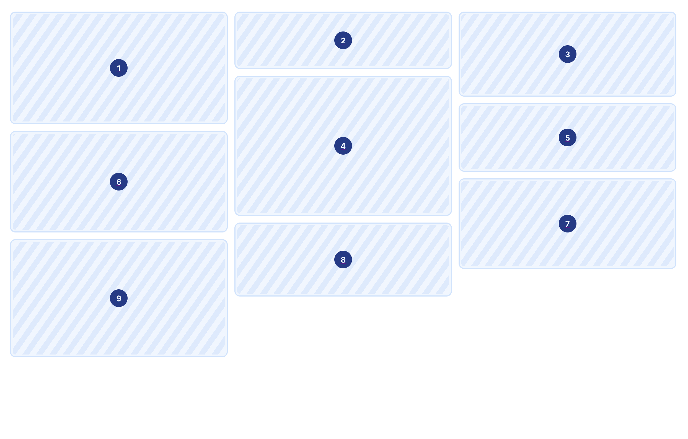
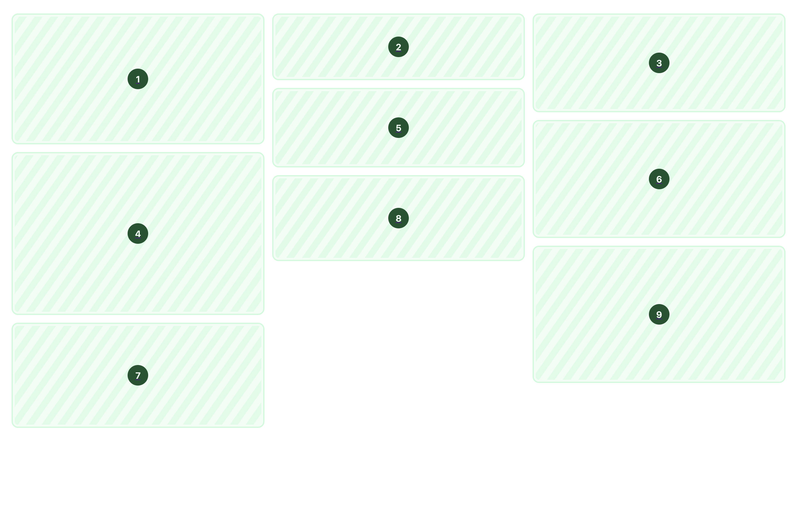
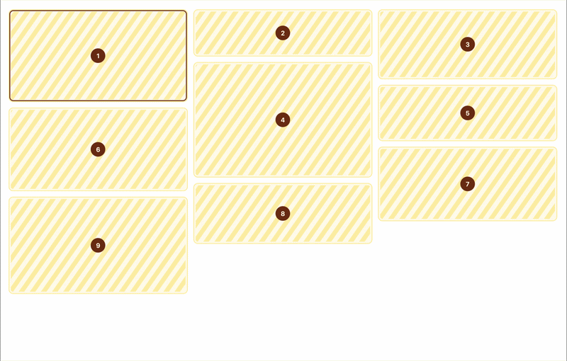

# Astro Masonry


Astro-native masonry layout component with shortest-column balancing, responsive breakpoints, and accessible arrow key navigation.

## Installation

```bash
npm install @mannisto/astro-masonry
```

```bash
pnpm add @mannisto/astro-masonry
```

```bash
yarn add @mannisto/astro-masonry
```

## Usage

```astro
---
import { Masonry } from "@mannisto/astro-masonry/components"
---

<Masonry columns={3}>
  {items.map((item) => (
    <div>{item}</div>
  ))}
</Masonry>
```

## Props

| Prop | Type | Default | Description |
|---|---|---|---|
| `columns` | `number` | `1` | Number of columns in fixed mode, or maximum cap when used with `autoColumns`. Defaults to unlimited when `autoColumns` is set |
| `gap` | `number \| string` | `"1rem"` | Gap between items. Numbers are treated as `px` |
| `breakpoints` | `Record<number, number>` | — | Map of `minWidth → columns`. Mobile-first, stacks on top of `columns` |
| `autoColumns` | `number \| string` | — | Fill as many columns as fit at this minimum width. Numbers are treated as `px` |
| `sequential` | `boolean` | `false` | Distribute items left to right, top to bottom instead of shortest-column |
| `aria-label` | `string` | — | Sets `aria-label` on the root element |
| `role` | `string` | — | Sets `role` on the root element |
| `class` | `string` | — | Class names on the root element |

## Examples

### Fixed columns

```astro
<Masonry columns={3}>
  {items.map((item) => (
    <div>{item}</div>
  ))}
</Masonry>
```


*Items are distributed into the shortest column, keeping overall height balanced.*

### Responsive columns

`columns` sets the base, `breakpoints` adds on top. Keys are minimum viewport widths in `px`.

```astro
<Masonry
  columns={1}
  breakpoints={{ 640: 2, 1024: 3 }}
>
  {items.map((item) => (
    <div>{item}</div>
  ))}
</Masonry>
```

### Auto-sizing columns

Fills as many columns as the container fits at the given minimum width. Responds automatically to container resize.

```astro
<Masonry autoColumns={280}>
  {items.map((item) => (
    <div>{item}</div>
  ))}
</Masonry>
```

### Auto-sizing with a maximum

`columns` limits the maximum number of columns when used with `autoColumns`.

```astro
<Masonry
  autoColumns={280}
  columns={4}
>
  {items.map((item) => (
    <div>{item}</div>
  ))}
</Masonry>
```

### Auto-sizing with a responsive maximum

`breakpoints` can adjust the cap at different viewport widths.

```astro
<Masonry
  autoColumns={280}
  columns={1}
  breakpoints={{ 640: 2, 1024: 4 }}
>
  {items.map((item) => (
    <div>{item}</div>
  ))}
</Masonry>
```

### Sequential order

Items are distributed left to right, top to bottom. Useful when reading order matters.

```astro
<Masonry columns={3} sequential>
  {items.map((item) => (
    <div>{item}</div>
  ))}
</Masonry>
```


*Items are distributed left to right, top to bottom, preserving reading order.*

## Keyboard navigation

When focus is inside the grid, arrow keys move between items:

| Key | Behaviour |
|---|---|
| `ArrowUp` | Previous item in the same column |
| `ArrowDown` | Next item in the same column |
| `ArrowLeft` | Item in the previous column at the same vertical position |
| `ArrowRight` | Item in the next column at the same vertical position |



## Accessibility

Screen readers navigate items in column order, matching the visual layout. Use `aria-label` and `role` to identify the grid as a landmark or feed.

```astro
<Masonry
  columns={3}
  aria-label="Photo gallery"
  role="feed"
>
  {items.map((item) => (
    <div>{item}</div>
  ))}
</Masonry>
```

## License

MIT © [Ere Männistö](https://github.com/eremannisto)